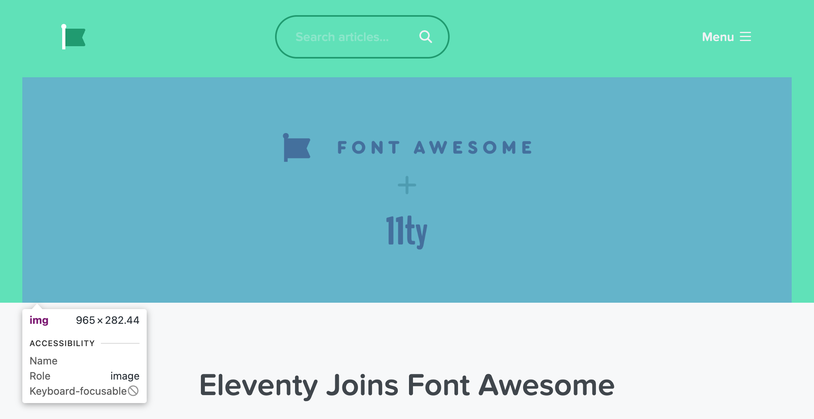
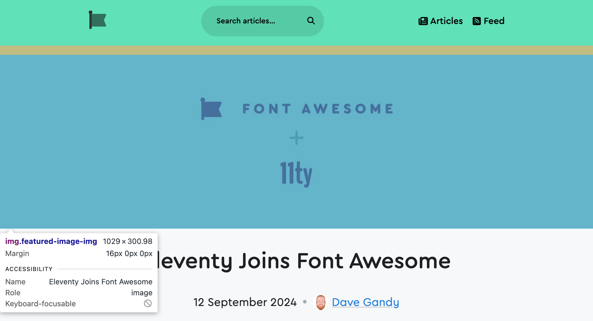
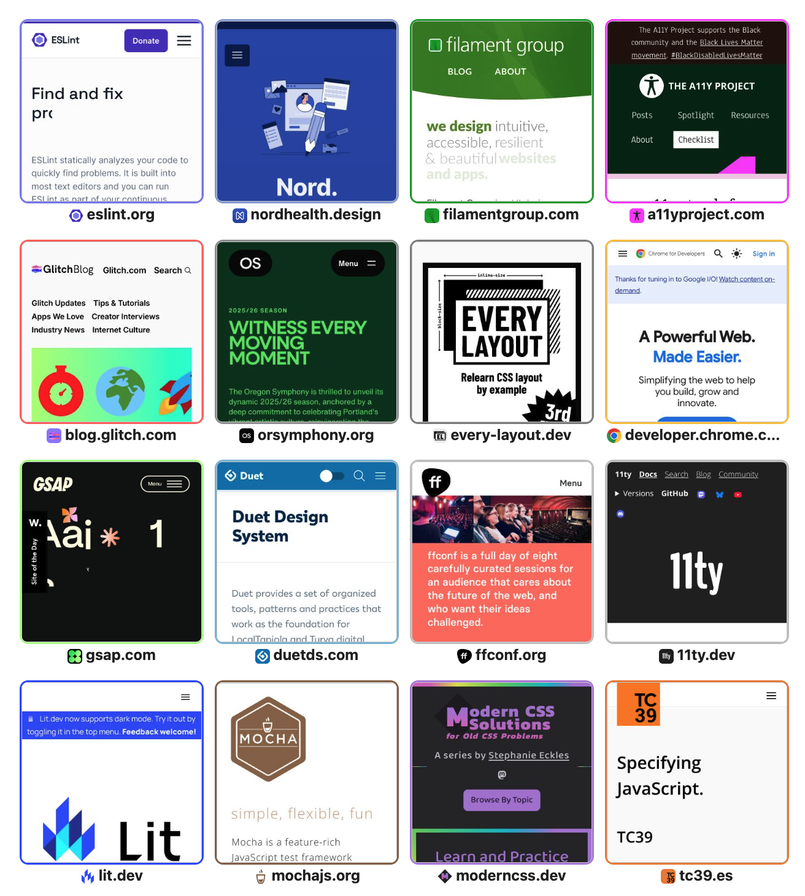

Working through the migration of Blog Awesome from WordPress to Eleventy, I encountered an interesting problem: each blog post was seeded with a featured image at the top, though the image did not cover the entirety of the header.

<script type="module" src="/static/browser-window.js"></script>
<browser-window shadow mode="dark" flush style="--bw-background: #62e6be">
	
</browser-window>

This required a manual process (a WordPress custom field) to specify a theme color to match the background of the image. We can do better!

Using a similar layout structure, this what the new design looks like (with a bit better automatic dark/light mode contrast on the flag and text color, too):

<browser-window shadow mode="dark" flush style="--bw-background: #62e6be">
	
</browser-window>

To accomplish this automation, I turned to a lovely zero-dependency package called [`extract-colors`](https://www.npmjs.com/package/extract-colors) from [`namide.com`](https://namide.com/).

In all of the eligible blog posts tested, the last color returned in the result from the `extract-colors` package always matched the background color of the image being sampled.

`extract-colors` recommends the use of another package ([`get-pixels`](https://www.npmjs.com/package/get-pixels)) to extract pixel data from images but it was no longer maintained so I [forked, updated, and released a Node.js only version of the package](https://fediverse.zachleat.com/@zachleat/113947026720491470) to fix some upstream issues.

## New `@11ty/image-color` Package

I wired this up with a [memoization layer](https://www.npmjs.com/package/memoize), a [disk cache](https://www.11ty.dev/docs/plugins/fetch/#manually-store-your-own-data-in-the-cache), a [concurrency queue](https://www.npmjs.com/package/p-queue), and integrated it with existing overlapping functionality provided by Eleventy [Fetch](https://www.11ty.dev/docs/plugins/fetch/) and [Image](https://www.11ty.dev/docs/plugins/image/) utilities for build performance (as well as adding [Color.js](https://colorjs.io/) for some color filtering) and packaged this all up for anyone to use at [`@11ty/image-color`](https://github.com/11ty/image-color):



To get colors from a local or remote Image in my Eleventy project, I added the following configuration code to my project’s `eleventy.config.js` file:

```js
import { getImageColors } from "@11ty/image-color";

export default async function(eleventyConfig) {
	eleventyConfig.addFilter("getImageColors", async (imageSrc) => {
		return getImageColors(imageSrc);
	});
}
```

The above Blog Awesome example above made good use of the `getImageColors` filter in a Nunjucks template:


```njk


	<style>
	header {
		background-color: {{ lastColor.background }};
		color: {{ lastColor.foreground }};
	}
	</style>

<header>…</header>
```


## Screenshot Borders

For extra funsies I also made use of this functionality on 11ty.dev ([now live on the site](https://www.11ty.dev/#built-with-eleventy)) to provide an extra accent border color on screenshot images:



This example works a little differently: it samples colors from the [favicon images](https://www.11ty.dev/docs/services/indieweb-avatar/) of each site as an easy way to guess the site’s theme colors.

This package doesn’t take a hard stance on the validity of colors but I did make use of additional filtering to select a nice border color from the list of colors available in each favicon, with the code looking something like this (again, `eleventy.config.js` Configuration code):

```js
import { getImageColors } from "@11ty/image-color";

export default async function(eleventyConfig) {
	eleventyConfig.addShortcode("getColorsForUrl", async (url) => {
		let avatarUrl = `https://v1.indieweb-avatar.11ty.dev/${encodeURIComponent(url)}/`;

		return getImageColors(avatarUrl).then(colors => {
			// Note the map to colorjs props here
			return colors.map(c => c.colorjs).filter(c => {
				// Not too dark, not too light
				return c.oklch.l > .4 && c.oklch.l <= .95;
			}).sort((a, b) => {
				return (b.oklch.l + b.oklch.c) - (a.oklch.l + a.oklch.c);
			});
		})
	});
};
```

…which subsequently wound up in a WebC template a little like this:

```html
<script webc:setup>
async function getPrimaryColorStyle(url) {
	let colors = await getColorsForUrl(url);
	if(colors.length > 0) {
		return `--card-border-color: ${colors[0].toString({format: "hex"})}`;
	}
}
</script>
<a :href="url" class="card" :style="getPrimaryColorStyle(url)">…</a>
```

## More Open Source

This Blog Awesome migration project (launching soon!) has yielded a few more useful open source utilities to the Eleventy ecosystem, which I encourage you to try out!

- [`@11ty/image-color`](https://github.com/11ty/image-color) (you already read about this here)
- [`@11ty/import`](https://github.com/11ty/eleventy-import) (import WordPress posts as Markdown files)
- [`@11ty/font-awesome`](https://github.com/11ty/eleventy-plugin-font-awesome) (use zero-JavaScript SVG icons)