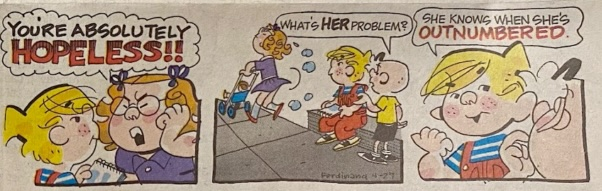

Our basement flooded this week, so I’ve been cleaning up the mess. In that process, I found a 22-year-old letter from my grandmother (who passed away Christmas 2023) to my mom that had a little Eleventy naming history that some folks might enjoy.

I first talked about the significance and history of the Eleventy name back in a [blog post from 2018 celebrating the project’s first birthday](/web/eleventy-birthday/#project-naming):

> I chose it because of a story my grandma Nonnie loved to tell about how I learned to count. Rather than move from ten to eleven like a normal child, I felt it appropriate to use the teen suffix for the numbers eleven and twelve, counting “ten, eleventy-teen, twelvety-teen, thirteen, …”

The discovery of this letter was very surprising to me as I hadn’t reviewed the contents of this box in almost 20 years (long before Eleventy). I’ll include a photo of the letter and of the newspaper clipping of the Dennis the Menace comic she had included below (with some redacted unrelated personal details for brevity).

> Dennis the Menace really hit a soft spot with me this week, so I am sending it to share with you. When Zach was about three or four, he was counting for me and after ten he said “leventy teen.” When I said, “But Zach, we don't say 'leventy teen,” I got this reply. “But I do. I do say 'leventy teen.” That has always been one of my favorite memories. So now we know there really is a “leventy teen.” He was right all the time.

_Miss you, Nonnie ❤️_