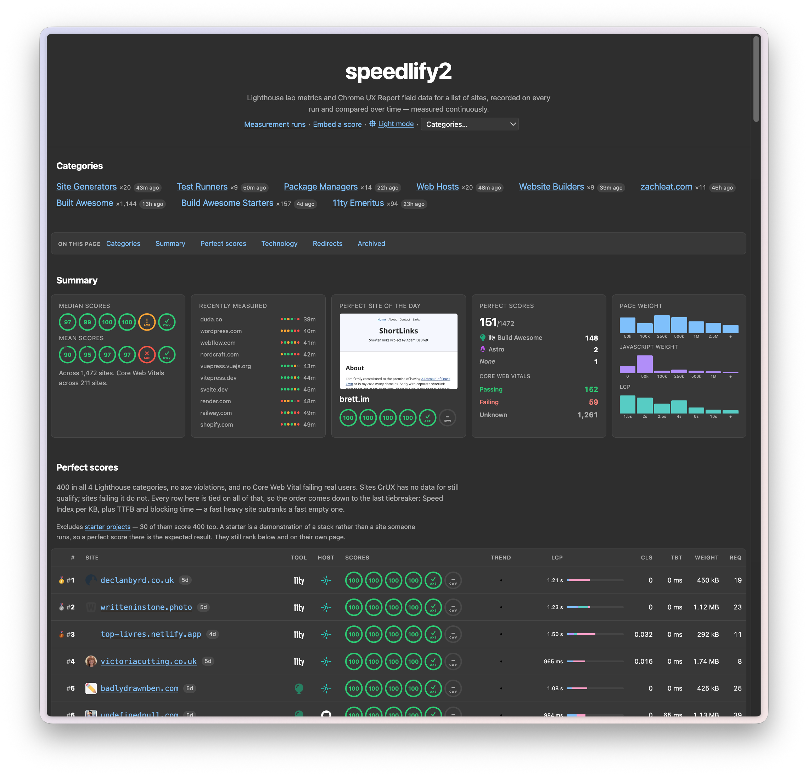

_[**`speedlify.dev`, now running Speedlify2**](https://www.speedlify.dev/)._

The year is 2020. Inspired by a lack of budget for a web performance monitoring tool, the [original Speedlify project](https://www.zachleat.com/web/speedlify/) _(Speedlify Classic)_ was shipped to continuously measure site performance. It ran [Lighthouse](https://developer.chrome.com/docs/lighthouse/) against a predetermined list of sites and ranked their performance against each other. Over time, I started to add a few more things to Speedlify.

1. A [`<speedlify-score>` Web Component](https://www.zachleat.com/web/lighthouse-in-footer/) was added to show scores on your web site.
1. The [Eleventy Leaderboards were migrated to use Speedlify](https://www.zachleat.com/web/eleventy-leaderboard-speedlify/), running 31 unique contests and testing 1208 unique websites.

As the Leaderboards grew, the work involved in maintaining them scaled similarly. Due to infrastructure build time constraints (a 15 minute build limit) and limitations in how Speedlify executed its measurement step (all sites would run serially and a compare step ran when all measurements had been taken), the Leaderboards needed to run on my own hardware.

Over six years, it’s pretty natural that some folks would let their websites and domains lapse. A few sites moved away to use other tools. All of which culminated in manual work to publish Leaderboard scores. You could probably see this reflected in how often the Leaderboards were published 🫣 — though in retrospect 31 runs in six years (~2 month cadence on adverage) isn’t bad!

## Better and more Automated

Regardless, I’m delighted to show off some huge updates and improvements have been made to the brand new Speedlify2. Changes which will ultimately save me a bunch of time and effort!

- Speedlify2 is _now measuring **1565 sites**_ continuously without requiring any manual work.
- Each category has its own cadence configuration, and the Built Awesome category is currently configured to visit sites once per week to measure and test.
- Everything is static and self contained, deployable in GitHub Actions. You can [fork and host your own Speedlify2](https://github.com/zachleat/speedlify2/) on GitHub Actions.
- Measurements happen in small chunks in parallel on GitHub Actions. The measurement step is now decoupled from ranking. When the site builds, it pulls from the newest measurements for all steps and ranks them. This is far more robust!
- Sites that move away from Build Awesome (11ty) are now automatically put into an unranked Emeritus category. I went ahead and backfilled the 92 websites that have moved away since we started the showcase in 2018. Emeritus sites _can_ show up on the Perfect Scores ranking on the home page (though at time of writing only 3 of the 92 of them do).
- Instead of the classic 4-circle Lighthouse design, this adds additional circles for Core Web Vitals (**field data alongside lab data**) and now explicitly shows the output of a more detailed and rigorous Axe CLI run. Lighthouse does _use_ Axe internally but doesn’t report everything (Speedlify2 does).
- Adds a new `<speedlify2-score>` component.
- The production service has backwards API compatibility with any legacy `<speedlify-score>` components using the old speedlify.dev instance as their data source (and all sites measured there are measured on the new speedlify.dev).
- Categories are no longer mutually exclusive. URLs can exist in multiple categories and the home page shows all of the perfect scoring sites across all categories. To avoid extra testing traffic, single measurements are re-used across categories.
- Adds a new randomly selected Perfect Site of the Day.
- This also shows screenshots for No-JavaScript and JavaScript-enabled, reporting the visual percentage difference between the two. This is not feeding into rankings (as it isn’t a foolproof measure) but it is useful to see which sites exclusively rely on client side rendering ([`solidjs.com`](https://www.solidjs.com/)) or sites that may have bugs in their dark/light mode switcher ([`nuxt.com`](https://nuxt.com/)).

## Highlighting Good Sites

The [Built Awesome Leaderboards](https://www.speedlify.dev/group/11ty-community/) are intended to be a very vigorous and competitive leaderboard. The sites that score well here are _very_ fast.

But (similarly to the Eleventy Leaderboards before them) we **don’t highlight bad scores**. The (exhaustively long) list is exclusive to sites with all green circles. With an exception for unknown Core Web Vitals, which requires a level of minimum production traffic in Chrome browsers to show data.

Sites with yellow or red circles are shown in an overflow list (randomly ordered) with no scores visible. You can navigate through to check your site’s page individually and review the report to learn how you can improve for the next run.

The other top level categories ([Web Hosts](https://www.speedlify.dev/group/hosts/), [Site Generators](https://www.speedlify.dev/group/ssg/), [Website Builders](https://www.speedlify.dev/group/builders/), [Package Managers](https://www.speedlify.dev/group/package-managers/) et al) are for corporate accountability and do show poorly scoring sites. This is a separate tact we want to avoid for personal or individual websites. We can and should hold professional and paid websites to a higher standard!