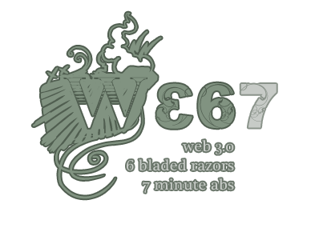

<style>
.about-primary-avatar {
	display: block;
	max-width: 260px;
	border-radius: 50%;
	margin: 2em auto;
}
.about-secondary-avatar {
	display: block;
	max-width: 260px;
	margin: 0;
}
</style>


<ul class="list-inline fl fl-inline fl-nowrap">
	<li>This web site is maintained by <strong>Zach Leatherman</strong> <em>(he, him, they)</em>.</li>
	<li>View his <a href="/resume/">full résumé</a> or about his <a href="/uses/">favorite tools</a>.</li>
</ul>

_For what it’s worth: if you’re trying to contact me I do prefer direct messages on Mastodon (or Bluesky) to email._

<ul class="list-inline fl fl-inline fl-nowrap">
	<li><a href="/web/feed/"><strong>Subscribe</strong></a></li>
	<li><a href="https://fediverse.zachleat.com/@zachleat"><strong>Mastodon</strong></a></li>
	<li><a href="https://bsky.app/profile/zachleat.com">Bluesky</a></li>
	<li><a href="https://github.com/zachleat/">GitHub</a></li>
	<li><a href="mailto:zach@zachleat.com"><span>Email</span></a></li>
	<li><a href="https://www.npmjs.com/~zachleat">npm</a></li>
	<li><a href="https://www.linkedin.com/in/zachleat/">LinkedIn</a></li>
	<li><a href="https://www.youtube.com/channel/UCMlSs0Ltg57qpYdFwUVLR2A">YouTube</a></li>
	<li><a href="https://codepen.io/zachleat/">Codepen</a></li>
	<li><a href="https://opencollective.com/zachleat">OpenCollective</a></li>
	<li><a href="https://letterboxd.com/zachleat/">Letterboxd</a></li>
	<li>Nintendo</li>
	<li>Apple Music</li>
	<li><del>Twitter</del> (2006–2022)</li>
	<li><a href="/twitter/">Twitter Archive</a></li>
	<li><del>Facebook</del> (2005–2016)</li>
	<li><a href="https://twitter.com/eleven_ty/">Twitter <code>@eleven_ty</code></a></li>
</ul>

## Bio



### Alternate Formats

Here to fetch my bio? Let’s appeal to your base instinct to copy and paste:

#### Plaintext

``` text
Zach is a builder for the web at Font Awesome and the creator/maintainer of Eleventy (11ty), an award-winning open source site generator. At one point he became entirely too fixated on web fonts. He has given {{ collections.all | getSpeakingCount: "type" }} talks in {{ collections.all | getSpeakingUniqueCount: "country" | numberString }} different countries at events like Beyond Tellerrand, Smashing Conference, Jamstack Conf, CSSConf, and The White House. Formerly part of CloudCannon, Netlify, Filament Group, NEJS CONF, and NebraskaJS.
```

#### HTML

``` html
Zach is a builder for the web at <a href="https://fontawesome.com/">Font Awesome</a> and the creator/maintainer of <a href="https://www.11ty.dev">Eleventy (11ty)</a>, an award-winning open source site generator. At one point he became entirely <a href="https://www.zachleat.com/web/fonts/"><em>too fixated</em> on web fonts</a>. He has given <a href="https://www.zachleat.com/web/speaking/">{{ collections.all | getSpeakingCount: "type" }} talks in {{ collections.all | getSpeakingUniqueCount: "country" | numberString }} different countries</a> at events like Beyond Tellerrand, Smashing Conference, Jamstack Conf, CSSConf, and <a href="https://www.zachleat.com/web/whitehouse/">The White House</a>. Formerly part of <a href="https://cloudcannon.com/">CloudCannon</a>, Netlify, <a href="https://www.filamentgroup.com/">Filament Group</a>, <a href="http://nejsconf.com/">NEJS CONF</a>, and <a href="http://nebraskajs.com">NebraskaJS</a>.
```

#### Markdown

``` markdown
Zach is a builder for the web at [Font Awesome](https://fontawesome.com/) and the creator/maintainer of [Eleventy (11ty)](https://www.11ty.dev), an award-winning open source site generator. At one point he became entirely [_too fixated_ on web fonts](https://www.zachleat.com/web/fonts/). He has given [{{ collections.all | getSpeakingCount: "type" }} talks in {{ collections.all | getSpeakingUniqueCount: "country" | numberString }} different countries](https://www.zachleat.com/web/speaking/) at events like Beyond Tellerrand, Smashing Conference, Jamstack Conf, CSSConf, and [The White House](https://www.zachleat.com/web/whitehouse/). Formerly part of Netlify, [Filament Group](https://www.filamentgroup.com/), [NEJS CONF](http://nejsconf.com/), and [NebraskaJS](http://nebraskajs.com).
```

## Photos

### Deprecated but saved for Posterity

<figure>
	
	<figcaption>Picture taken by <a href="https://www.facebook.com/andrey.davydchyk">Andrey Davydchyk</a> at <a href="https://www.facebook.com/cssminskjs/">CSS Minsk JS</a>. <a href="/img/bio-2017.jpg">Download JPEG version</a>.</figcaption>
</figure>

<figure>
	
	<figcaption>Modified from above for avatar use.</figcaption>
</figure>

<figure>
	
	<figcaption>Picture taken by <a href="https://twitter.com/marcthiele">Marc Thiele</a> at <a href="/web/smashingconf/2014/">SmashingConf Whistler</a>. Download the <a href="/img/bio.jpg">original version</a>.</figcaption>
</figure>

<figure>
	
	<figcaption>Deprecated.</figcaption>
</figure>

<figure>
	
	<figcaption>This web site was started in 2007 and was originally titled <strong>Web 3.0, 6 Bladed Razors, and 7 Minute Abs</strong>.</figcaption>
</figure>

## Site History

_This information has [moved to `/uses/`](/uses/)._
