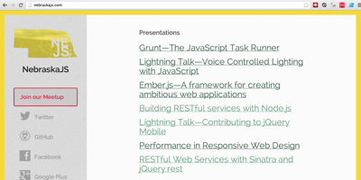

View all project source code on [GitHub](https://github.com/zachleat/).

## [SocialCount][socialcount]
[][socialcount]

[socialcount]: /web/socialcount/

SocialCount is a small jQuery plugin for progressively enhanced, lazy loaded, mobile friendly social networking widgets.

## [BigText][bt]
[][bt]

[bt]:/web/bigtext-makes-text-big/

 The BigText jQuery plugin takes a single element and sizes the text inside of its child block elements to fit the width of the parent element. Gives the text that lovely vertical alignment. Be sure to check out the demo! Also on [Github](http://github.com/zachleat/bigtext).

## [A Front End Engineer’s Manifesto][f2em]
[][f2em]

[f2em]: /web/manifesto/

Guidelines I use when looking at the big picture as a Front End Web Developer. 

## [NebraskaJS][nejs]
[][nejs]

[nejs]: http://nebraskajs.com/

Local JavaScript User Group.

## [parseIntimate][pi]
[][pi]

[pi]: http://parseintimate.com

 A Valentine’s Day website to spend a little quality time with JavaScript and it’s quirky parseInt function. Don’t be afraid to get parseIntimate.

## [ALARMd 2][alarmd2]
[][alarmd2]

[alarmd2]: /alarmd2/

An online alarm clock that wakes you up to YouTube, Pandora, MP3 or other multimedia source. Featuring integration with Google Calendar.  On [Github](http://github.com/zachleat/ALARMd).

## [ALARMd](/alarmd/)

First iteration of the alarm clock that plays YouTube videos or other multimedia sources.  See ALARMd 2 above.

## [Raging Netflix Queue][rnq]
[][rnq]

[rnq]: /web/raging-netflix-queue/

This Google Chrome extension will recognize movie web sites and one click on the extension will automatically add that title to your queue.

## [Pretty Date JavaScript](/web/yet-another-pretty-date-javascript/)

Utility to show the relative difference between a time and now. On [Github](http://github.com/zachleat/Humane-Dates). Also available [in PHP](/web/php-pretty-date/).

## [Traci Clevenger Photography][tc]
[][tc]

[tc]: http://www.traciclevenger.com/

A full screen photography portfolio website. On [Github](http://github.com/zachleat/Parlour).

## [JavaScript Gravatar Plugin](/web/scare-your-visitors-with-this-javascript-gravatar-plugin/)

Retrieve a gravatar image dynamically from any e-mail address. On [Github](http://github.com/zachleat/jQuery-Gravatar).

## [scrollf][scr]
[][scr]

[scr]: /scrollf/

A draggable  infinite-scroll [flickr](http://www.flickr.com/) image browser (similar to Google Maps)

## [maLArquee][mal]
[][mal]

[mal]: /projects/Malarquee/

A strange project creating a marquee.

### [Omaha Bounty Hunter][obh]
[][obh]

 [obh]: http://obh.herokuapp.com/

 A game built for Hack Omaha using Open Crime Data. Guess how much the owner thought their stolen item was worth.

* * *

## Retired Projects

### Tournology

Tournology makes tournament coordination easy. _Retired._

### [ALP][alp]
[][alp]

[alp]: http://sourceforge.net/projects/alp/

 _Also known as Autonomous LAN Party_. As one of the administrators of the local computer group [nerdclub](http://www.nerdclub.net/), wrote an open source project to help administrate and coordinate LAN Parties, still in use by LAN Parties all over the world. Check out [an example of ALP](http://www.nerdclub.net/25jun2004/intranet/tournaments.html). _Retired_

### GiftBright

 Take the guesswork out of buying gifts for kids. **Winner of Startup Weekend Omaha March 2010.** _Retired_

### Call Spinner

 A way to anonymously meet new friends using nothing but your phone. **Winner of Startup Weekend Omaha September 2010.** _Retired_

### [Registrastination][reg]
[][reg]

[reg]: /registrastination/

A site encouraging voter registration for the 2008 US Presidential Election. _Retired_

### [JavaScript Code Coverage Tool for Firebug](/web/javascript-code-coverage-tool-for-firebug/)

 On [Github](http://github.com/zachleat/Firebug-Code-Coverage). _Retired_

### [DomDom, DOM Node Creation Utility](/web/domdom-easy-dom-element-creation/)

 Create new DOM nodes from CSS Selector Syntax. _Retired_